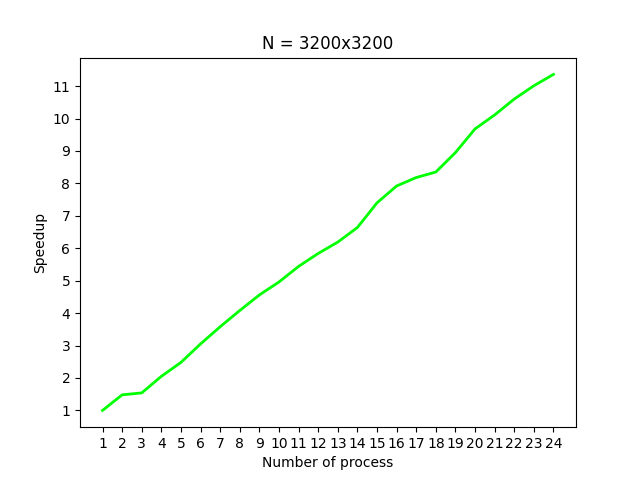
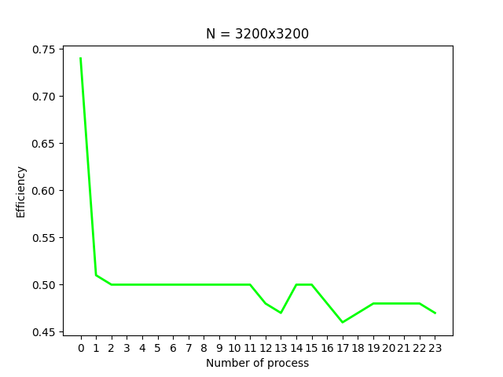
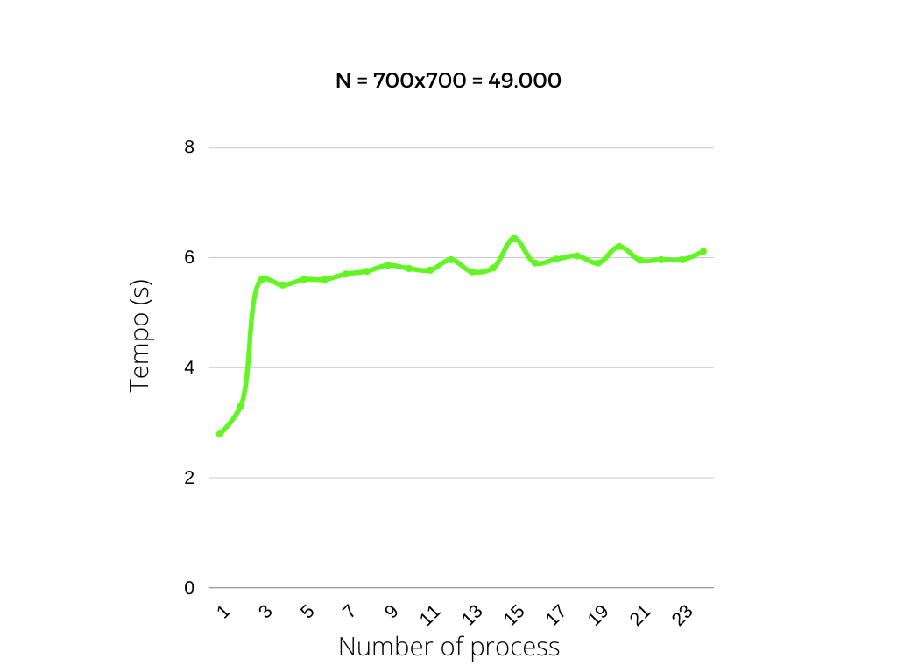

# Forest-fire Simulation on a MPI cluster

### Realized by Davide Iovino for course's project of Concurrent, Parallel and  on cloud programming

## Table of Contents
1. Introduzione al problema
2. Soluzione proposta
3. Dettagli implementativi
4. Correttezza della soluzione
5. Istruzioni per l'esecuzione
6. Benchmark
7. Conclusioni

## 1. Introduzione al problema
> In matematica applicata, il forest-fire model prevede la simulazione di un incendio boschivo attraverso l'utilizzo di una matrice e due probabilità.   
Il modello è definito come un automa cellulare su una griglia di NxN celle. Una cella può essere vuota, occupata da un albero o in fiamme. Il modello di Drossel e Schwabl (1992) è definito da quattro regole che vengono eseguite contemporaneamente: 
> * Una cella in fiamme si trasforma in una cella vuota.
> * Un albero va in fiamme se almeno un vicino sta bruciando.
> * Un albero si infiamma con probabilità f anche se nessun vicino sta bruciando (probabilità di autocombustione).
> * Uno spazio vuoto si riempie con un albero con probabilità p.

> La simulazione si interrompe dopo un numero massimo di step S oppure quando l'intera griglia è vuota.

## 2. Soluzione proposta
> La soluzione prevede che tutti i processi coinvolti lavorino equamente, dunque sia il master che i worker lavorano su sottomatrici (quasi) uguali.
> La strategia di risoluzione prevede principalmente un'organizzazione in tre macro-problemi: suddivisione della matrice, esecuzione parallela sulle sottomatrici e raccolta delle stesse.  

### &nbsp;&nbsp;2.1. Suddivisione della matrice
> La distribuzione del carico prevede l'assegnazione equa della matrice da parte del processo master ai worker. L'idea alla base è di assegnare *(M/P)+1* righe ai processi *0* e *P-1*, mentre per i restanti processi vengono assegnate *(M/P)+2* righe,  dove M rappresenta il numero di righe della matrice e P il numero totale di processi. Inoltre, viene gestito il caso in cui P non sia multiplo di M, assegnando ai primi R processi una riga in più. Questo approccio è necessario per permettere ad ognuno di lavorare sulla prima e l'ultima riga della sottomatrice di lavoro, consultando quando necessario le celle appartenenti alle righe di confine degli altri processi.
> Poiché si sta effettuando una suddivisione per righe della matrice, per velocizzare quanto più possibile le comunicazioni tra i processi è stata adottata una topologia cartesiana che permette un'organizzazione <b>logica</b> dei processi in una griglia bidimensionale, quest'ultimi, in questo caso,  sono stati disposti l'uno sotto l'altro esattamente come le porzioni della matrice originale, inoltre, grazie al parametro *reorder* si delega ad MPI la ricerca della migliore disposizione dei processi all'interno della topologia, aumentandone l'efficienza. Di seguito il codice che permette di avere questa griglia bidimensionale di P righe e 1 colonna.

    void create_topology(int nproc, MPI_Comm *new_comm){
        int dim = 2, ndim[2] = {nproc, 1}, period[2] = {0, 0}, reorder = 1;
        MPI_Cart_create(MPI_COMM_WORLD, dim, ndim, period, reorder, new_comm);
    }

### &nbsp;&nbsp;2.2. Esecuzione parallela

> Il modello prevede l'esecuzione di al più S passi discreti. All'inizio di ogni passo vengono scambiate le righe di confine tra i diversi processi in maniera non bloccante, ciò permette di lavorare sulle righe della sottomatrice di lavoro che non dipendono da quelle di altri processi. Alla fine del lavoro sulle righe intermedie si attende, eventualmente, che le comunicazioni vengano concluse. Successivamente, ogni processo dovrà dunque lavorare sulla prima e sull'ultima riga della sottomatrice di lavoro. Per la lavorazione delle celle è stato adottato il modello di vicinanza di Von Neumann, dunque le 4 celle: sopra, sotto, destra, sinistra. Alla fine di ogni passo discreto, viene controllata se la matrice è completamente vuota, in maniera tale da terminare l'esecuzione parallela e passare alla raccolta dei dati.

### &nbsp;&nbsp;2.3. Raccolta dei dati

> L'ultimo step prevede la raccolta delle sottomatrici da parte del processo master da ogni worker e la stampa del tempo totale di esecuzione. Quest'ultimo viene calcolato a partire dall'istruzione successiva alla generazione della matrice fino alla raccolta delle sottomatrici da parte del processo master.

## 3. Dettagli implementativi

> Per l'analisi della soluzione proposta viene seguito lo stesso scheletro del paragrafo 2.  
Innanzitutto, vengono definite come MACRO le probabilità del modello:

    #define ignite_prob 15  //A tree ignites with this probability (f), 0 <= ignite_prob <= 100  
    #define grow_prob 0     //A tree grows on an empty cell with this probability (p), 0 <= grow_prob <= 100  
    #define gen_prob 70     //Probability that a tree grows, used for the matrix generation, 0 <= gen_prob <= 100  
    #define S 25            //Number of steps  

> La struttura dati scelta è una semplice matrice di char per rappresentare la griglia del modello, decisione ponderata per la facilità di adattabilità al problema e il minor peso (1 byte vs 4 byte per cella) rispetto ad una matrice di interi.

### &nbsp;&nbsp;3.1. Distribuzione dei dati

> Le prime considerazioni da effettuare sono sul numero di righe su cui ogni processo deve lavorare e sulla dimensione della sottomatrice da allocare. Inoltre, per permettere la distinzione tra i diversi passi discreti vengono utilizzate due matrici di dimensioni uguali: una per lettura ed una per scrittura, che alla fine di ogni passo vengono swappate tramite l'utilizzo dei puntatori.  
> Ogni processo calcola dunque la dimensione della sua sottomatrice e il numero di righe su cui deve lavorare.

    //partizionamento della matrice e allocazione sottomatrici
    R =  M % P;
    //calcolo numero di righe di ogni sottomatrice (nrows), primo ed ultimo processo ricevono una riga di confine in meno
    if (rank == 0 || rank == P-1){
        nrows = M/P + 1;
    } else {
        nrows = M/P + 2;
    }
    // i primi R processi ricevono una riga in più, quando M non è multiplo di P
    if (rank < R){
        nrows += 1;
    }
    
    //assegnazione indici riga iniziale e finale delle sottomatrici di lavoro (righe di scrittura work_rows)
    if (rank == 0) {
        start_index = 0;
        work_rows = nrows - 1; 
    } else if(rank == P-1) {
        start_index = 1;
        work_rows = nrows - 1;
    } else {
        start_index = 1;
        work_rows = nrows - 2;
    }  
    
> Dopo il calcolo di queste informazioni si procede all'inizializzazione degli array necessari per l'utilizzo della *ScatterV* e della *GatherV*, utilizzate per la distribuzione e la raccolta delle matrici.

### &nbsp;&nbsp;3.2. Esecuzione parallela

> L'idea risolutiva del problema prevede questa suddivisione temporale in S passi discreti. All'inizio di ogni passo i processi comunicano tra loro per l'invio asincrono delle righe ai bordi, che dunque dipendono da altri processi, nel frattempo che le comunicazioni si concludano, ogni processo lavora sulle righe intermedie della matrice, per poi attendere la fine della comunicazione e lavorare sulla prima e ultima riga, appena ricevute tramite le comunicazioni.  
> Per evitare spreco di memoria, sia le *Isend* che le *Irecv* vanno a leggere e scrivere direttamente la porzione di sottomatrice di interesse, permettendo di evitare l'utilizzo di ulteriori buffer.
    
    //comunicazione con altri processi
    if (rank == 0){
        //invio ultima riga al processo successivo
        MPI_Isend(&recv[work_rows*N - N], N, MPI_CHAR, rank+1, 0, MPI_COMM_WORLD, &request[0]);
        //ricezione prima riga dal processo successivo
        MPI_Irecv(&recv[work_rows*N], N, MPI_CHAR, rank+1, 1, MPI_COMM_WORLD, &request[1]);
    } else if (rank == P-1) {
        //invio prima riga al processo precedente
        MPI_Isend(&recv[N], N, MPI_CHAR, rank-1, 1, MPI_COMM_WORLD, &request[1]);
        //ricezione ultima riga dal processo precedente
        MPI_Irecv(recv, N, MPI_CHAR, rank-1, 0, MPI_COMM_WORLD, &request[0]);
    } else {
        //invio prima riga al precedente e ultima riga al successivo
        MPI_Isend(&recv[N], N, MPI_CHAR, rank-1, 1, MPI_COMM_WORLD, &request[1]);
        MPI_Isend(&recv[work_rows*N], N, MPI_CHAR, rank+1, 0, MPI_COMM_WORLD, &request[0]);
        //ricezione prima riga dal precedente e ultima riga dal successivo
        MPI_Irecv(recv, N, MPI_CHAR, rank-1, 0, MPI_COMM_WORLD, &request[0]);
        MPI_Irecv(&recv[work_rows*N + N], N, MPI_CHAR, rank+1, 1, MPI_COMM_WORLD, &request[1]);
    }
    
    //lavoro su righe non di confine, non dipendono da altri processi
    for(int i=start_index + 1; i<start_index + work_rows - 1; i++){
        for(int j=0; j<N; j++){
            if (recv[(i*N) + j] == 'E'){
                check_tree_grows(next, i, j, N);
            } else if (recv[(i*N) + j] == 'T') {
                check_neighbors_ignite(recv, next, i, j, N, nrows);
            } else if (recv[(i*N) + j] == 'B') {
                next[(i*N) + j] = 'E';
            }  
            if (next[(i*N) + j] == 'E')  empty_counter += 1;
        }
    }
    
    MPI_Waitall(2, request, MPI_STATUSES_IGNORE);    
    
    //lavora esclusivamente sulle righe di bordo ricevute dagli altri processi
    int i = start_index;
    for(int j=0; j<N; j++){
        if (recv[(i*N) + j] == 'E'){
            check_tree_grows(next, i, j, N);
        } else if (recv[(i*N) + j] == 'T') {
            check_neighbors_ignite(recv, next, i, j, N, nrows);
        } else if (recv[(i*N) + j] == 'B') {
            next[(i*N) + j] = 'E';
        }
        
        if (next[(i*N) + j] == 'E')  empty_counter += 1;
    }
    
    i = start_index + work_rows - 1;
    for(int j=0; j<N; j++){
        if (recv[(i*N) + j] == 'E'){
            check_tree_grows(next, i, j, N);
        } else if (recv[(i*N) + j] == 'T') {
            check_neighbors_ignite(recv, next, i, j, N, nrows);
        } else if (recv[(i*N) + j] == 'B') {
            next[(i*N) + j] = 'E';
        }
        
        if (next[(i*N) + j] == 'E')  empty_counter += 1;
    }

> A seguire della computazione sulle sottomatrici viene effettuato un controllo per conoscere se lo stato dell'intera matrice, distribuita tra i diversi processi, è completamente vuota o meno. L'idea per risolvere questa problematica prevede l'utilizzo della *MPI_Reduce*, dove la variabile *empty_counter* di ogni processo viene sommata e inviata al processo master, quest'ultimo, in base al valore della variabile, informa i worker se la matrice è completamente vuota o meno attraverso l'invio di un booleano grazie ad una *MPI_Bcast*.

    //controllo se tutte le celle sono vuote, ha senso solo quando grow prob -> 0
    MPI_Reduce(&empty_counter, &empty_matrix, 1, MPI_INT, MPI_SUM, 0, MPI_COMM_WORLD);
    if (rank == 0){
        if (empty_matrix == M*N){
            empty_matrix = 1;
        } else {
            empty_matrix = 0;
        }
    }
    MPI_Bcast(&empty_matrix, 1, MPI_INT, 0, MPI_COMM_WORLD);
    if (empty_matrix == 1)
        break;
        
### &nbsp;&nbsp;3.3. Raccolta dei dati

> La parte di raccolta dei dati viene semplicemente gestita attraverso una GatherV, i cui parametri sono stati calcolati precedentemente.

## 4. Correttezza della soluzione

> La dimostrazione della correttezza riguardo la soluzione proposta consta di vari accorgimenti: l'idea alla base è stata quella di creare due varianti del file *.c* con alcune differenze.  
> Per entrambe, le probabilità *p* ed *f* sono state abbassate a 0, per evitare di introdurre pseudo-casualità all'interno dei programmi, inoltre, la generazione della matrice iniziale è stata modificata inserendo lungo la diagonale principale solo celle in fiamme. Infine, al concludersi di ogni step viene scritta su un file la matrice di lavoro.  
> La prima variante è una semplice implementazione sequenziale dell'algoritmo che scrive su file ad ogni passo discreto la matrice di lavoro.  
> La seconda variante invece, prevede l'esecuzione parallela dell'algoritmo anticipando la *MPI_GatherV* alla fine di ogni step, permettendo di salvare sul file la matrice di lavoro.   
> Infine, per automatizzare il confronto delle matrici (di grandi dimensioni) prodotte delle due versioni è stato scritto un piccolo script in C, che verifica riga per riga i due file *.txt* creati dalle due varianti. Inoltre, sono state stampate delle emoji per rendere i file di testo generati meno pesanti da controllare manualmente. Di seguito un esempio del file generato da una matrice 4x4.

> Matrice iniziale  
[🔥] [🌲] [🌲] [🌲]   
[🌲] [🔥] [🌲] [🌲]   
[🌲] [❌] [🔥] [🌲]    
[🌲] [🌲] [🌲] [🔥]   

> Matrice al 1 passo discreto  
[❌] [🔥] [🌲] [🌲]   
[🔥] [❌] [🔥] [🌲]   
[🌲] [❌] [❌] [🔥]     
[🌲] [🌲] [🔥] [❌]    

> Matrice al 2 passo discreto  
[❌] [❌] [🔥] [🌲]      
[❌] [❌] [❌] [🔥]      
[🔥] [❌] [❌] [❌]       
[🌲] [🔥] [❌] [❌]     

> Matrice al 3 passo discreto  
[❌] [❌] [❌] [🔥]        
[❌] [❌] [❌] [❌]         
[❌] [❌] [❌] [❌]         
[🔥] [❌] [❌] [❌]         

> Matrice al 4 passo discreto  
[❌] [❌] [❌] [❌]      
[❌] [❌] [❌] [❌]      
[❌] [❌] [❌] [❌]      
[❌] [❌] [❌] [❌]      

> Esperimento finito

## 5. Istruzioni per l'esecuzione

> Come prerequisito di base è necessario un ambiente con installato OpenMPI. Dopo aver effettuato una copia in locale del progetto si può procedere in due modi: uno per la verifica della correttezza e uno per i benchmarks. 

### &nbsp;&nbsp;5.1. Esecuzione correttezza

> Riguardo la correttezza bisogna innanzitutto assicurarsi che le probabilità e il numero di step (MACRO) del problema combacino nei file *forest_corr_seq.c* e *forest_corr_par.c*, in seguito è necessario compilare ed eseguire entrambi, tramite i soliti comandi:

    gcc forest_corr_seq.c -o seq    
    mpicc forest_corr_par.c -o par
    mpirun --allow-run-as-root -np 1 ./seq M N
    mpirun --allow-run-as-root -np P ./par M N
        
> Dove M è il numero di righe, N è il numero di colonne e P il numero di processi. Successivamente, verranno prodotti due file *.txt* contenenti le stampe della matrice lungo i diversi passi. Se si vuole automatizzare il controllo basta compilare il file *check_correctness.c* ed eseguirlo: quest'ultimo scandirà riga per riga i due file ed evidenzierà le differenze, se presenti.
> L'idea era quella di fornire, insieme allo script, un file bash che automatizzasse ciò effettuando 15 test e stampando eventualmente le differenze tra le esecuzioni con valori differenti. Purtroppo, a causa dell'inesperienza con questo linguaggio, non sempre lo script stampa in output i valori corretti, dunque viene allegato solo per completezza, ma a volte evidenzia differenze che non ci sono.
> N.B. Il seguente programma funziona correttamente con al più 4096 caratteri per ogni riga del file, delimitata da '\n'.

    gcc check_correctness.c -o check
    ./check

### &nbsp;&nbsp;5.2. Esecuzione benchmarks

> Riguardo l'esecuzione dei file per i benchmarks è necessaria la compilazione dei file: *forest_bench_seq.c* e *forest_bench_par.c*, in seguito è necessario eseguire entrambi, tramite i soliti comandi:

    mpicc forest_bench_seq.c -o seq    
    mpicc forest_bench_par.c -o par
    mpirun --allow-run-as-root -np 1 ./seq M N
    mpirun --allow-run-as-root -np P ./par M N
        
> Dove M è il numero di righe, N è il numero di colonne e P il numero di processi.

## 6. Benchmark

> Per la fase di benchmarking è stato testato il comportamento della soluzione proposta: sia in termini di scalabilità forte, dove la dimensione dell'input è costante e il numero di processori varia, sia in termini di scalabilità debole, con la dimensione dell'input costante per ogni processore. Le analisi sono state effettuate su un cluster GCP di 6 nodi (e2-standard-4), ognuno con 4 vCPU e 16GB di RAM. 
> Inoltre, per la strong scalability, lo speedup analizzato è quello assoluto, dunque, viene previsto il rapporto tra il tempo di esecuzione sequenziale dell'algoritmo puramente sequenziale con quello parallelo. Si è scelto di procedere in questa maniera, senza analizzare lo speedup relativo, per mettere in evidenza la bontà della soluzione proposta rispetto alla capacità di parallelizzazione del problema.
> Dunque, si hanno due file: *forest_bench_par.c* e *forest_bench_seq.c* che prevedono solo la stampa del tempo di esecuzione e che sono stati utilizzati per effettuare i benchmarks. Per ottenere un'informazione più consona e solida, i test (per ogni configurazione) sono stati ripetuti due o più volte, effettuando la media del tempo di esecuzione.
> La dimensione del problema su cui effettuare l'analisi è stata individuata dopo una serie di esperimenti atti a cercare tempi di esecuzione né troppo esosi, evitando lunghe attese, né troppo brevi, rendendo difatti inutile il calcolo parallelo, di seguito sono riportate le scelte effettuate affinché l'ultimo esperimento della weak scalability si avvicinasse alla dimensione scelta per la strong scalability (11.760.000 vs 10.240.000).
N.B. Si ricorda che il problema prevede al più *S* passi discreti (quando la foresta non brucia completamente), dunque, ponendo la probabilità di crescita di un albero all'interno di una cella vuota al 5% è stato scelto di avere al più *S=250* passi.

<table border=1px align="center">
   <thead>
      <tr>
         <th>Scalability</th>
         <th>N</th>
      </tr>
   </thead>
   <tbody align="center">
      <tr>
         <td>Weak</td>
         <td>49.000 (for process)</td>
      </tr>
      <tr>
         <td>Strong</td>
         <td>3200x3200</td>
      </tr>
   </tbody>
</table>

### &nbsp;&nbsp;6.1. Strong scalability

> Per quest'analisi vengono adottati i seguenti valori:

    N = 3200 x 3200
    #define ignite_prob 15  //A tree ignites with this probability (f), 0 <= ignite_prob <= 100    
    #define grow_prob 5     //A tree grows on an empty cell with this probability (p), 0 <= grow_prob <= 100   
    #define gen_prob 80     //Probability that a tree grows, used for the matrix generation, 0 <= gen_prob <= 100     
    #define S 250           //Number of steps 

<table border=1px align="center">
   <thead>
      <tr>
        <th># Process</th>
        <th>Time (s)</th>
        <th>Speedup</th>
        <th>Efficiency</th>
      </tr>
   </thead>
   <tbody align="center">
      <tr>
         <td>1</td>
         <td>57.6140</td>
         <td>-</td>
         <td>1</td>
      </tr>
      <tr>
         <td>2</td>
         <td>38.8734</td>
         <td>1.48</td>
         <td>0.74</td>
      </tr>
      <tr>
         <td>3</td>
         <td>37.3940</td>
         <td>1.54</td>
         <td>0.51</td>
      </tr>
      <tr>
         <td>4</td>
         <td>28.0105</td>
         <td>2.05</td>
         <td>0.51</td>
      </tr>
      <tr>
         <td>5</td>
         <td>23.2318</td>
         <td>2.48</td>
         <td>0.49</td>
      </tr>
      <tr>
         <td>6</td>
         <td>18.8609</td>
         <td>3.05</td>
         <td>0.51</td>
      </tr>
      <tr>
         <td>7</td>
         <td>16.1220</td>
         <td>3.58</td>
         <td>0.51</td>
      </tr>
      <tr>
         <td>8</td>
         <td>14.1098</td>
         <td>4.08</td>
         <td>0.51</td>
      </tr>
      <tr>
         <td>9</td>
         <td>12.6158</td>
         <td>4.56</td>
         <td>0.51</td>
      </tr>
      <tr>
         <td>10</td>
         <td>11.6160</td>
         <td>4.96</td>
         <td>0.49</td>
      </tr>
      <tr>
         <td>11</td>
         <td>10.5904</td>
         <td>5.44</td>
         <td>0.49</td>
      </tr>
      <tr>
         <td>12</td>
         <td>9.8700</td>
         <td>5.84</td>
         <td>0.49</td>
      </tr>
      <tr>
         <td>13</td>
         <td>9.3140</td>
         <td>6.19</td>
         <td>0.48</td>
      </tr>
      <tr>
         <td>14</td>
         <td>8.6823</td>
         <td>6.64</td>
         <td>0.47</td>
      </tr>
      <tr>
         <td>15</td>
         <td>7.7868</td>
         <td>7.40</td>
         <td>0.49</td>
      </tr>
      <tr>
         <td>16</td>
         <td>7.2716</td>
         <td>7.92</td>
         <td>0.49</td>
      </tr>
      <tr>
         <td>17</td>
         <td>7.0409</td>
         <td>8.18</td>
         <td>0.48</td>
      </tr>
      <tr>
         <td>18</td>
         <td>6.9043</td>
         <td>8.35</td>
         <td>0.46</td>
      </tr>
      <tr>
         <td>19</td>
         <td>6.4394</td>
         <td>8.95</td>
         <td>0.47</td>
      </tr>
      <tr>
         <td>20</td>
         <td>5.9434</td>
         <td>9.68</td>
         <td>0.48</td>
      </tr>
      <tr>
         <td>21</td>
         <td>5.7040</td>
         <td>10.11</td>
         <td>0.48</td>
      </tr>
      <tr>
         <td>22</td>
         <td>5.4400</td>
         <td>10.6</td>
         <td>0.48</td>
      </tr>
      <tr>
         <td>23</td>
         <td>5.2369</td>
         <td>11.01</td>
         <td>0.48</td>
      </tr>
      <tr>
         <td>24</td>
         <td>5.0709</td>
         <td>11.36</td>
         <td>0.47</td>
      </tr>
   </tbody>
</table>

> Dalla tabella sopra riportata si evince uno speedup rallentato dall'overhead di comunicazione, che prevede ad ogni step lo scambio delle righe di confine e delle variabili necessarie per verificare che l'intera matrice sia vuota. Inoltre, come ci si aspettava, all'aumentare del numero di processi, il tempo di esecuzione decresce stabilmente appiattendosi verso la fine, sintomo dell'aumento dell'overhead di comunicazione rispetto alle righe da computare per ogni worker che invece decrescono.  
Si può invece notare come l'efficienza sia stabile lungo le diverse esecuzioni, evidenziando un utilizzo quasi costante del singolo core, ciò dovuto al numero costante di elementi che vengono scambiati. Infatti, indipendentemente dal numero di processi, il processo i-esimo comunicherà sempre e solo le 4 righe di confine e la variabile *empty_counter*.

### &nbsp;&nbsp;6.2. Weak scalability

> Come già affermato precedentemente, il workload scelto per ogni processo è di una matrice di dimensioni 700x700, dunque ogni processo va a lavorare su 490.000 celle, gli altri valori invece, sono gli stessi della strong scalability.
> N.B. Ogni esperimento ha previsto l'incremento delle sole righe della matrice (700x700, 1400x700, 2100x700...).

<table border=1px align="center">
   <thead>
      <tr>
        <th># Process</th>
        <th>Total time (s)</th>
      </tr>
   </thead>
   <tbody align="center">
      <tr>
         <td>1</td>
         <td>2.7955</td>
      </tr>
      <tr>
         <td>2</td>
         <td>3.3071</td>
      </tr>
      <tr>
         <td>3</td>
         <td>5.6141</td>
      </tr>
      <tr>
         <td>4</td>
         <td>5.5654</td>
      </tr>
      <tr>
         <td>5</td>
         <td>5.6073</td>
      </tr>
      <tr>
         <td>6</td>
         <td>5.6114</td>
      </tr>
      <tr>
         <td>7</td>
         <td>5.7038</td>
      </tr>
      <tr>
         <td>8</td>
         <td>5.7507</td>
      </tr>
      <tr>
         <td>9</td>
         <td>5.8604</td>
      </tr>
      <tr>
         <td>10</td>
         <td>5.8062</td>
      </tr>
      <tr>
         <td>11</td>
         <td>5.7736</td>
      </tr>
      <tr>
         <td>12</td>
         <td>5.96328</td>
      </tr>
      <tr>
         <td>13</td>
         <td>5.7451</td>
      </tr>
      <tr>
         <td>14</td>
         <td>5.8163</td>
      </tr>
      <tr>
         <td>15</td>
         <td>6.3546</td>
      </tr>
      <tr>
         <td>16</td>
         <td>5.9015</td>
      </tr>
      <tr>
         <td>17</td>
         <td>5.9744</td>
      </tr>
      <tr>
         <td>18</td>
         <td>6.0304</td>
      </tr>
      <tr>
         <td>19</td>
         <td>5.9046</td>
      </tr>
      <tr>
         <td>20</td>
         <td>6.2019</td>
      </tr>
      <tr>
         <td>21</td>
         <td>5.9509</td>
      </tr>
      <tr>
         <td>22</td>
         <td>5.9622</td>
      </tr>
      <tr>
         <td>23</td>
         <td>5.9626</td>
      </tr>
      <tr>
         <td>24</td>
         <td>6.1182</td>
      </tr>
   </tbody>
</table>

## 7. Conclusioni

> Per concludere, l'algoritmo giova sicuramente dalla parallelizzazione, anche se non appieno, ciò è dovuto alle comunicazioni che vengono effettuate ad ogni step e che limitano sicuramente quello che è lo speedup, di certo, evitando il controllo sull'assenza di alberi nella matrice si potrebbero ottenere dei miglioramenti. Per il resto, l'utilizzo di procedure non bloccanti e strategie atte al "risparmio" di memoria ha permesso di ottenere comunque buoni risultati.

